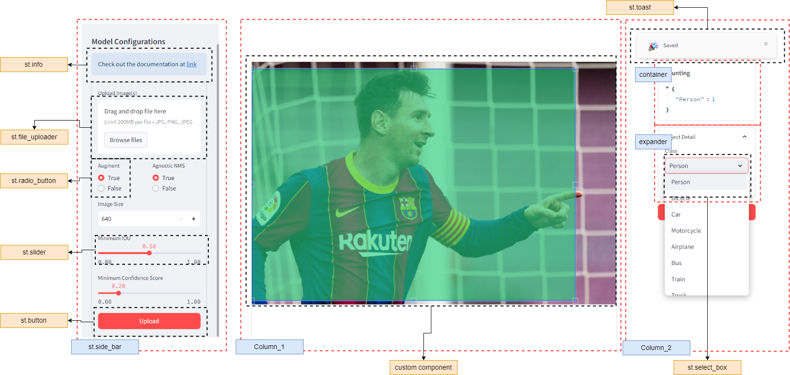

# Streamlit for Object Detection

---

## Quick Usage

Install requirements

```bash
conda create --name streamlit_demo python=3.11
conda activate streamlit_demo

pip install -r requirements.txt
```

Run app

```bash
python launch.py
```

## Screenshots

